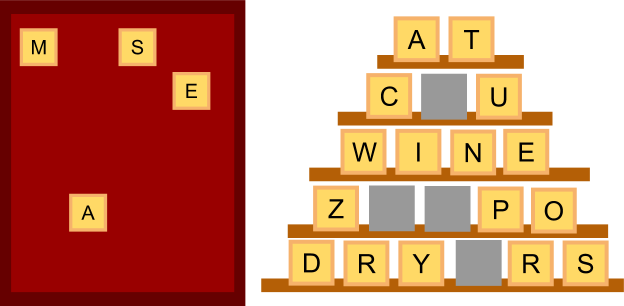

DABBLE

Mouseclick-controlled Java word game which uses GUI and Object-oriented programming. A board of 20 random letters are given to the user, who must then try to fill a pyramid board by finding word combinations of 2, 3, 4, 5, and 6 letters using the letters given.

